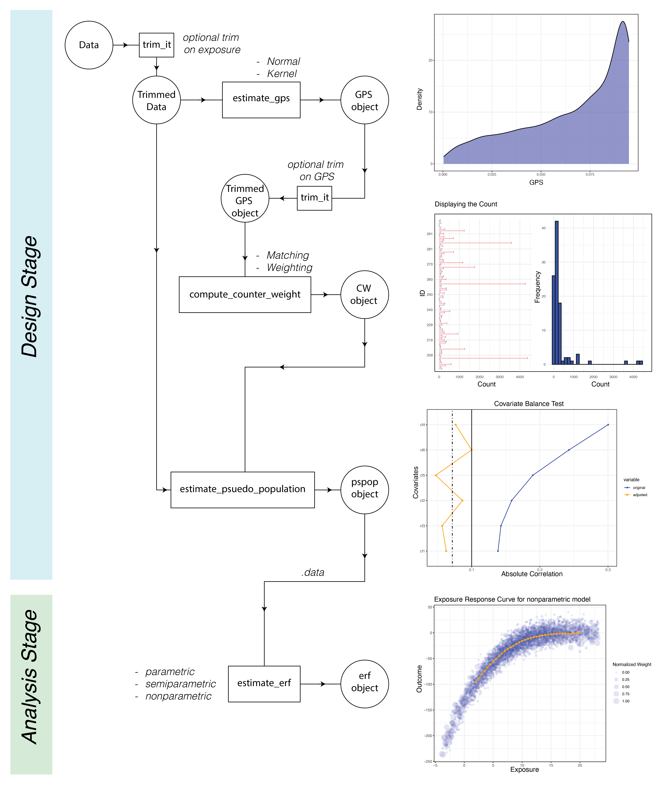

# CausalGPS


| Resource    |  Github Actions      |  Code Coverage  |
| ----------  | -------------------- |-----------------|
| Platforms   | Windows, macOS, Linux|  codecov        |
| R CMD check | [](https://github.com/NSAPH-Software/CausalGPS/actions) | [](https://app.codecov.io/gh/NSAPH-Software/CausalGPS/) |

Matching on generalized propensity scores with continuous exposures

## Summary

`CausalGPS` is an R package that implements matching on generalized propensity scores with continuous exposures. The package introduces a novel approach for estimating causal effects using observational data in settings with continuous exposures, and a new framework for GPS caliper matching that jointly matches on both the estimated GPS and exposure levels to fully adjust for confounding bias.

## Installation

- Installing from source

```r
library("devtools")
install_github("NSAPH-Software/CausalGPS")
library("CausalGPS")
```

- Installing from CRAN 

```r
install.packages("CausalGPS")
```

- Setting up docker environment

Developing Docker image can be downloaded from Docker Hub. See more details in docker_singularity.

## Usage

The CausalGPS package encompasses two primary stages: Design and Analysis. The Design stage comprises estimating GPS values, generating weights or counts of matched data, and evaluating the generated population. The Analysis stage is focused on estimating the exposure-response function. The following figure represents the process workflow

<p align="center">
  
</p>


### Estimating GPS values

GPS values can be estimated using two distinct approaches: `kernel` and `normal`.

```r
set.seed(967)
m_d <- generate_syn_data(sample_size = 500)

m_xgboost <- function(nthread = 1,
                      ntrees = 35,
                      shrinkage = 0.3,
                      max_depth = 5,
                      ...) {SuperLearner::SL.xgboost(
                        nthread = nthread,
                        ntrees = ntrees,
                        shrinkage=shrinkage,
                        max_depth=max_depth,
                        ...)}

gps_obj <- estimate_gps(.data = m_d,
                        .formula = w ~ I(cf1^2) + cf2 + I(cf3^2) + cf4 + cf5 + cf6,
                        sl_lib = c("m_xgboost"),
                        gps_density = "normal")

```

where

- `.data` A data.frame of input data including the `id` column.  
- `.formula` The formula for modeling exposure based on provided confounders.  
- `sl_lib` A vector of prediction algorithms.   
- `gps_density` A model type which is used for estimating GPS value, including `normal` (default) and `kernel`.   

### Computing weight or count of matched data

The second step in processing involves computing the weight or count of matched data. For the former, the weighting approach is used, and for the latter, the matching approach.

```r
cw_object_matching <- compute_counter_weight(gps_obj = gps_obj,
                                             ci_appr = "matching",
                                             bin_seq = NULL,
                                             nthread = 1,
                                             delta_n = 0.1,
                                             dist_measure = "l1",
                                             scale = 0.5)
                                             
```

where 

- `ci_appr` The causal inference approach. Possible values are:   
  - "matching": Matching by GPS   
  - "weighting": Weighting by GPS   
- `bin_seq` Sequence of w (treatment) to generate pseudo population. If NULL is passed the default value will be used, which is `seq(min(w)+delta_n/2,max(w), by=delta_n)`.   
- `nthread` An integer value that represents the number of threads to be used by internal packages in a shared memory system.  

If `ci.appr` = `matching`:   
   - `dist_measure`: Distance measuring function. Available options:   
     - l1: Manhattan distance matching   
   - `delta_n`: caliper parameter.   
   - `scale`: a specified scale parameter to control the relative weight that is attributed to the distance measures of the exposure versus the GPS.  

### Estimating psuedo population

The pseudo population is created by combining the counter_weight of data samples with the original data, including the outcome variable.

```r
pseudo_pop_matching <- generate_pseudo_pop(.data = m_d,
                                            cw_obj = cw_object_matching,
                                            covariate_col_names = c("cf1", "cf2", "cf3",
                                                                    "cf4", "cf5", "cf6"),
                                            covar_bl_trs = 0.1,
                                            covar_bl_trs_type = "maximal",
                                            covar_bl_method = "absolute")
```

where

- `covar_bl_method`: covariate balance method. Available options:   
  - 'absolute'   
- `covar_bl_trs`: covariate balance threshold   
- `covar_bl_trs_type`: covariate balance type (mean, median, maximal)   


### Estimating exposure response function

The exposure-response function can be computed using parametric, semiparametric, and nonparametric approaches.

```r
erf_obj_nonparametric <- estimate_erf(.data = pseudo_pop_matching$.data,
                                       .formula = Y ~ w,
                                       weights_col_name = "counter_weight",
                                       model_type = "nonparametric",
                                       w_vals = seq(2,20,0.5),
                                       bw_seq = seq(0.2,2,0.2),
                                       kernel_appr = "kernsmooth")
                                       
```

where

- `w_vals`:  A numeric vector of values at which you want to calculate the exposure response function.  
- `bw_seq`: A vector of bandwidth values.   
- `kernel_appr`: Internal kernel approach. Available options are locpol and kernsmooth.   


## Notes

- Trimming data for extreme exposure value, or trimmming gps_obj for extreme GPS values, can be done by using `trim_it` function.

```r
trimmed_data <- trim_it(data_obj = m_d,
                        trim_quantiles = c(0.05, 0.95),
                        variable = "w")
```

-  For the prediction model, we use the [SuperLearner](https://github.com/ecpolley/SuperLearner) package. Users must prepare a wrapper function for the options available in SuperLearner to have a function with customized parameters. For instance, in the code below, we override the default values of nthread, ntrees, shrinkage, and max_depth. For example, in the following code, we override `nthread`, `ntrees`, `shrinkage`, and `max_depth` default values.

```r
m_xgboost <- function(nthread = 1,
                      ntrees = 35,
                      shrinkage = 0.3,
                      max_depth = 5,
                      ...) {SuperLearner::SL.xgboost(
                        nthread = nthread,
                        ntrees = ntrees,
                        shrinkage=shrinkage,
                        max_depth=max_depth,
                        ...)}
```

- To test your code and run examples, you can generate synthetic data.

```r
syn_data <- generate_syn_data(sample_size=1000,
                              outcome_sd = 10,
                              gps_spec = 1,
                              cova_spec = 1)

```

## Contribution

For more information about reporting bugs and contribution, please read the contribution page from the package web page. 

## Code of Conduct

Please note that the CausalGPS project is released with a [Contributor Code of Conduct](https://www.contributor-covenant.org/version/2/1/code_of_conduct.html). By contributing to this project, you agree to abide by its terms.


## References

- CausalGPS method paper

```
@article{wu2022matching,
  title={Matching on generalized propensity scores with continuous exposures},
  author={Wu, Xiao and Mealli, Fabrizia and Kioumourtzoglou, Marianthi-Anna and Dominici, Francesca and Braun, Danielle},
  journal={Journal of the American Statistical Association},
  pages={1--29},
  year={2022},
  publisher={Taylor \& Francis}
}
```

- CausalGPS software paper

```
@misc{khoshnevis2023causalgps,
      title={CausalGPS: An R Package for Causal Inference With Continuous Exposures}, 
      author={Naeem Khoshnevis and Xiao Wu and Danielle Braun},
      year={2023},
      eprint={2310.00561},
      archivePrefix={arXiv},
      primaryClass={stat.CO},
      DOI={h10.48550/arXiv.2310.00561}
}
```

